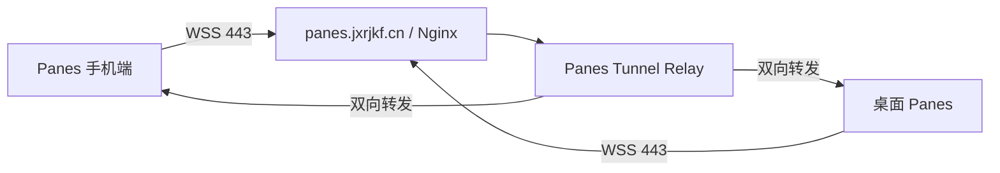
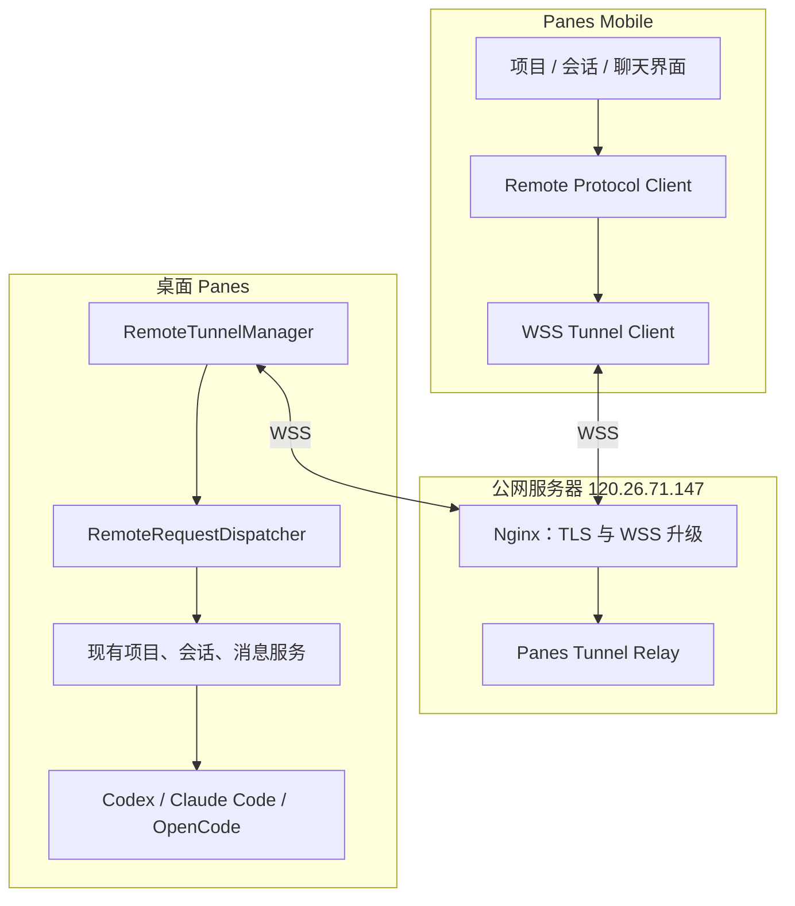

# Panes 手机版设计方案

## 1. 文档信息

- 功能名称：Panes 手机版远程访问
- 方案状态：已实施，待真机验收
- 桌面执行端：Panes
- 手机端：Panes Mobile
- 第一版网络模式：固定公网服务器 + WSS 反向隧道 + 全量中继
- 公网服务器 IP：`120.26.71.147`
- 公网域名：`panes.jxrjkf.cn`
- 公网端口：`443`
- WSS 入口：`wss://panes.jxrjkf.cn/ws/tunnel`
- SSL：复用 `panes.jxrjkf.cn` 现有证书

## 2. 建设目标

Panes 手机版不是桌面界面的等比例缩小版，而是桌面 Panes 的远程聊天控制端。

用户可以在不同桌面 Panes 中分别生成二维码，并在同一台手机上添加多台 Panes。完成连接后，可以在外出状态下：

- 查看当前在线的桌面 Panes。
- 查看桌面 Panes 中的项目。
- 查看项目下面的会话。
- 查看会话历史消息。
- 向指定会话继续发送消息。
- 实时接收智能体已完成的回复及会话未读提示；流式内容暂不推送。
- 停止当前正在执行的任务。

项目、会话、模型调用和本地文件仍由桌面 Panes 负责。手机端只发送远程指令并展示桌面端返回的数据。

## 3. 已确认的第一版决策

### 3.1 网络决策

第一版只实现一种网络模式：桌面 Panes 和手机端都主动连接固定公网 WSS 入口，由公网服务器完成双向转发。



采用该模式后，两端都只需具备普通的公网访问能力，不需要知道对方的真实 IP。

### 3.2 第一版不包含的网络能力

- 局域网设备发现。
- 局域网直连。
- 公网 IPv4 或 IPv6 直连。
- UPnP、NAT-PMP、PCP 自动端口映射。
- STUN、ICE、UDP 打洞和 NAT 穿透。
- QUIC、WebRTC DataChannel 或 P2P 数据通道。
- TURN 或其他备用中继线路。
- 多个公网中继节点和自动容灾。

即使手机和桌面电脑位于同一局域网，第一版也统一经过公网 WSS 服务器，不设计单独的局域网分支。

### 3.3 业务边界

网络层只负责建立隧道和双向转发。手机与哪台桌面 Panes 关联、采用 Token、账号密码、设备指纹还是其他认证方式，属于业务层。

第一版业务层采用最简单的“一次性二维码配对 Token”完成闭环；协议应保留替换认证方式的能力，但本期不建设完整账号体系。

## 4. 总体架构



### 4.1 手机端职责

- 扫描桌面 Panes 生成的二维码，或粘贴配对内容。
- 保存多台 Panes 的配对结果、远程入口信息和当前 Panes 选择。
- 建立并维护 WSS 连接。
- 请求项目、会话和消息数据。
- 发送用户消息和停止指令。
- 展示已完成助手消息、会话未读提示、运行状态和错误状态。
- 断线后自动重连并重新获取当前状态。

### 4.2 公网服务器职责

- 在 `443` 端口提供统一 WSS 入口。
- 接收桌面 Panes 主动建立的长连接。
- 接收手机端主动建立的长连接。
- 根据网络级 `tunnel_id` 找到对应的两条连接。
- 将两端的业务数据帧原样双向转发。
- 维护在线状态、心跳时间和连接生命周期。
- 拒绝无效、过期或超出限制的连接和数据帧。

第一版公网服务器不读取项目和会话数据库，不调用 Codex、Claude Code 或 OpenCode，也不长期保存聊天内容。

### 4.3 桌面 Panes 职责

- 在用户开启“手机远程访问”后主动连接公网 WSS 入口。
- 生成并持久化本机的 `tunnel_id` 和设备身份。
- 生成一次性二维码配对信息。
- 接收手机端请求并调用 Panes 现有应用服务。
- 把项目、会话和消息查询结果返回手机端；仅把已完成的助手消息事件推送给已识别手机设备。
- 在 Panes 退出、远程访问关闭或凭证被撤销时主动断开连接。

桌面端是远程功能的唯一业务执行端。手机端和公网服务器都不得直接读写桌面 Panes 的 SQLite 数据库。

## 5. 公网服务器设计

### 5.1 对外入口

```text
wss://panes.jxrjkf.cn/ws/tunnel
```

- DNS：`panes.jxrjkf.cn` 解析到 `120.26.71.147`。
- 外部端口：`443`。
- TLS：复用现有 SSL 证书。
- 协议：WebSocket Secure。
- 第一版部署：单节点。

### 5.2 Nginx 职责

Nginx 只承担公网入口职责：

- 终止 TLS。
- 完成 WebSocket Upgrade。
- 将 `/ws/tunnel` 转发到本机 Panes Tunnel Relay。
- 设置连接超时、请求大小限制和基础访问日志。
- 日志中不得记录 Token、业务消息正文或完整查询参数。

参考结构如下，内部端口在部署时按服务器实际占用情况确定：

```nginx
location /ws/tunnel {
    proxy_pass http://127.0.0.1:18080;
    proxy_http_version 1.1;
    proxy_set_header Upgrade $http_upgrade;
    proxy_set_header Connection "upgrade";
    proxy_set_header Host $host;
    proxy_read_timeout 3600s;
    proxy_send_timeout 3600s;
    proxy_buffering off;
}
```

### 5.3 Tunnel Relay

Tunnel Relay 是通用的 WSS 反向隧道服务。它只需维护：

```text
tunnel_id -> desktop_connection
tunnel_id -> mobile_connection
```

第一版每个 `tunnel_id` 只允许一个桌面连接和一个活动手机连接。后续如需多手机同时连接，再扩展为手机连接集合。

连接建立后的处理流程：

1. 客户端连接统一 WSS 地址。
2. 客户端发送隧道握手帧，声明 `role`、`tunnel_id`、协议版本和认证信息。
3. Relay 校验握手帧并登记连接。
4. 同一个 `tunnel_id` 的两端都在线后，Relay 开始双向转发。
5. 任意一端断开时，Relay 通知另一端并清理连接映射。
6. 客户端按退避策略重新连接。

Tunnel Relay 在完成握手后不解析业务消息内容，只按连接关系转发 WebSocket 文本帧或二进制帧。

### 5.4 第一版服务端状态

第一版连接关系只保存在内存中：

- 服务重启后连接映射清空。
- 桌面端和手机端自动重新连接。
- 不引入 Redis。
- 不做多节点共享连接。
- 不提供离线消息队列。
- 不保存项目、会话和聊天正文。

## 6. 二维码与首次配对

### 6.1 桌面端入口

建议在 Panes 设置中增加：

`设置 → 手机远程访问`

页面包含：

- 开启或关闭手机远程访问。
- 当前公网服务连接状态。
- 生成或刷新二维码。
- 已绑定手机摘要。
- 撤销已绑定手机。

### 6.2 二维码内容

第一版二维码建议包含：

```json
{
  "version": 1,
  "endpoint": "wss://panes.jxrjkf.cn/ws/tunnel",
  "tunnel_id": "随机 UUID",
  "relay_credential": "Relay 连接凭据",
  "pairing_token": "一次性随机 Token",
  "expires_at": "UTC 时间"
}
```

要求：

- `tunnel_id` 使用不可预测的随机值。
- `pairing_token` 只能使用一次。
- `relay_credential` 只用于 Relay 握手；手机完成业务配对后，业务请求改用桌面签发的正式 `device_credential`。
- 配对 Token 建议在生成后 5 分钟内有效。
- 二维码刷新后，旧的未使用 Token 立即失效。
- Token 不写入 Nginx URL，不进入普通访问日志。
- 手机完成配对后保存正式设备凭证，不继续使用二维码 Token。

### 6.3 配对流程

1. 用户在桌面 Panes 中开启手机远程访问。
2. 桌面 Panes 建立 WSS 连接并显示二维码。
3. 手机扫描二维码并连接同一个 WSS 入口。
4. 手机提交二维码中的配对信息。
5. 桌面 Panes 校验一次性 Token。
6. 桌面 Panes 返回正式连接凭证和设备摘要。
7. 手机将该桌面保存为一条独立的 Panes 设备配置，二维码 Token 作废。
8. 手机首页展示该 Panes；用户可将其设为当前 Panes 并请求其项目和会话列表。

第一版可直接采用 Token 完成配对。设备指纹、账号密码、统一账户、多因素认证等能力留给后续业务层扩展。

## 7. WSS 隧道协议

### 7.1 隧道握手帧

```json
{
  "version": 1,
  "type": "tunnel.hello",
  "role": "desktop",
  "tunnel_id": "随机 UUID",
  "credential": "连接凭证"
}
```

`role` 第一版支持：

- `desktop`
- `mobile`

握手成功后，Relay 返回：

```json
{
  "version": 1,
  "type": "tunnel.ready",
  "connection_id": "本次连接 ID",
  "peer_online": true
}
```

### 7.2 心跳

第一版采用应用层心跳：

- 每 25 秒发送一次 `tunnel.ping`。
- 收到后立即回复 `tunnel.pong`。
- 连续 75 秒没有收到有效消息或心跳，判定连接失效。
- 连接失效后关闭旧连接并进入自动重连。

### 7.3 重连

重连等待时间建议为：

```text
1 秒 → 2 秒 → 5 秒 → 10 秒 → 30 秒
```

达到 30 秒后保持 30 秒间隔，网络恢复并连接成功后重置退避状态。

桌面端重连成功后重新登记 `tunnel_id`。手机端重连成功后重新请求项目、会话和当前活动会话状态，不依赖服务端补发断线期间的业务消息。

### 7.4 消息限制

- 第一版业务数据使用 JSON 文本帧。
- 单帧最大长度建议限制为 1 MiB。
- 手机首次打开会话时，桌面端一次返回该会话的全部历史消息；第一版不做历史消息分页。
- 第一版不通过隧道传输大文件和附件。
- Relay 必须实现发送队列上限和背压处理，慢客户端不得无限占用内存。

## 8. 手机与桌面业务协议

Tunnel Relay 只转发数据。以下业务协议由手机端和桌面 Panes 处理。

### 8.1 通用消息格式

请求：

```json
{
  "version": 1,
  "kind": "request",
  "id": "请求 UUID",
  "method": "workspace.list",
  "payload": {}
}
```

响应：

```json
{
  "version": 1,
  "kind": "response",
  "id": "原请求 UUID",
  "ok": true,
  "payload": {}
}
```

事件：

```json
{
  "version": 1,
  "kind": "event",
  "event": "thread.message.completed",
  "targetDeviceId": "桌面端分配的手机设备 ID",
  "payload": {
    "threadId": "会话 ID",
    "messageId": "消息 ID",
    "message": {}
  }
}
```

所有请求都必须携带唯一 `id`。对会产生写操作的请求，桌面 Panes 使用该 ID 做短期幂等校验，避免手机断线重试造成重复发送。桌面端向手机发送的事件必须带 `targetDeviceId` 和 `payload.threadId`：`targetDeviceId` 用于定位并校验目标手机，`threadId` 用于手机端路由到正确会话。事件已经在对应 Panes 的 WSS 连接中传输，因此手机端本地状态的完整键为 `panesId + threadId`。

### 8.2 第一版方法

| 方法 | 说明 |
| --- | --- |
| `desktop.get_status` | 获取桌面 Panes 在线状态和版本 |
| `workspace.list` | 获取项目列表 |
| `thread.list` | 获取指定项目下的未归档会话 |
| `message.list` | 一次获取指定会话的全部历史消息 |
| `message.send` | 向指定会话发送用户消息 |
| `turn.stop` | 停止指定会话当前执行 |
| `device.identify` | 确认当前手机设备 ID，并登记该设备的实时接收通道 |

手机界面中的“项目”对应 Panes 的 workspace；如果一个 workspace 包含多个 repo，手机端在项目详情中展示仓库摘要，不把不同 repo 错误地拆成独立 Panes 项目。

### 8.3 第一版事件

| 事件 | 说明 |
| --- | --- |
| `desktop.status_changed` | 桌面在线、离线或版本变化 |
| `thread.updated` | 会话标题、状态或更新时间变化 |
| `thread.message.completed` | 指定会话新增一条已完成的助手消息；事件带目标设备 ID 和会话 ID |
| `turn.finished` | 本轮执行完成 |
| `turn.failed` | 本轮执行失败 |
| `turn.stopped` | 本轮执行已停止 |

第一版只发送已完成的助手消息，不发送流式文本、推理过程或工具过程。桌面 Panes 应把现有线程和最终消息事件转换成稳定的远程协议，手机端不得依赖 Codex、Claude Code 或 OpenCode 的原始事件格式。

## 9. 桌面 Panes 集成设计

### 9.1 复用现有数据和执行链

Panes 现有数据模型已经包含 workspace、repo、thread、message、action 和 approval。远程功能应复用现有应用服务，不复制新的项目、会话和消息数据库。

现有 Tauri IPC 和远程请求形成两个实际调用入口时，允许把对应业务逻辑下沉为共享的 Rust 内部方法，由 Tauri command 和 RemoteRequestDispatcher 共同调用。不得为了远程功能复制一套发送消息或获取会话的实现。

### 9.2 建议新增 Rust 模块

```text
src-tauri/src/remote/mod.rs
src-tauri/src/remote/tunnel.rs
src-tauri/src/remote/protocol.rs
src-tauri/src/remote/dispatcher.rs
src-tauri/src/commands/remote.rs
src-tauri/src/db/remote_devices.rs
```

职责建议：

- `tunnel.rs`：WSS 连接、心跳、重连和发送队列。
- `protocol.rs`：版本化的请求、响应和事件 DTO。
- `dispatcher.rs`：将远程方法分派到现有 Panes 应用服务。
- `commands/remote.rs`：远程访问开关、二维码和绑定设备管理 IPC。
- `db/remote_devices.rs`：保存本机 `tunnel_id`、已绑定手机和撤销状态。

### 9.3 建议新增桌面前端模块

```text
src/components/settings/RemoteAccessSettings.tsx
src/stores/remoteAccessStore.ts
```

同时调整：

```text
src/types.ts
src/lib/ipc.ts
src-tauri/src/lib.rs
src-tauri/src/state.rs
src-tauri/src/commands/mod.rs
src-tauri/src/db/mod.rs
src/i18n/resources/en/
src/i18n/resources/pt-BR/
src/i18n/resources/zh-CN/
```

## 10. 手机端设计

### 10.1 技术方案

手机端使用官方命令 `npx degit dcloudio/uni-preset-vue#vite-ts mobile` 创建为 `uni-app + Vue 3 + TypeScript` CLI 工程。入口文件、`manifest.json`、`pages.json` 和页面代码均位于官方脚手架规定的 `mobile/src/` 下。扫码、凭据存储和 WSS 连接分别使用 `uni.scanCode`、uni-app Storage API 和 `uni.connectSocket`，不依赖浏览器专用运行时。

第一阶段同时生成 H5 产物和原生 App 打包资源；Android/iOS 共用业务协议、页面和状态管理。原生 App 资源交给 HBuilderX 完成签名和 APK/AAB/IPA 打包。

### 10.2 UniApp 页面、路由与多 Panes 设计

#### 10.2.1 设计前提

一台手机可以添加、保存并连接多台桌面 Panes。手机端不能再把配对信息设计成单个 `PairingConfig`，也不能把“当前 Panes”误当成唯一已绑定设备。

配对属于设置中的设备管理能力：首页负责展示已添加的全部 Panes，并让用户快速切换当前工作目标；项目、会话、消息和附件则属于当前选中 Panes 的业务数据。

未添加任何 Panes 也是首页的正常状态。首页显示“尚未添加 Panes”以及进入设置的入口，不把首页跳转或替换为扫码配对流程。

#### 10.2.2 页面目录

手机端按标准 UniApp 页面拆分为以下页面：

```text
mobile/src/pages/
├─ index/index.vue                    首页：Panes 切换与当前 Panes 项目列表
├─ project/index.vue                  项目详情：当前项目下的会话列表与新建会话
├─ conversation/index.vue             会话详情：消息、附件、模型、思考强度和权限
├─ settings/index.vue                 设置首页
├─ settings/panes/index.vue           我的 Panes：已添加设备列表与管理入口
├─ settings/panes/add.vue             添加 Panes：扫码或粘贴配对内容
└─ settings/panes/detail.vue          单台 Panes：名称、状态、重新配对和解除绑定
```

`settings/panes/add.vue` 是设置模块下的子页面，不是应用启动页，也不是首页。二维码扫描和粘贴配对内容只从“设置 → 我的 Panes → 添加 Panes”进入。

模型、思考强度、权限、图片和文件选择都属于会话页面上下文，使用会话页内的底部弹层或系统选择器，不额外拆成业务页面。

#### 10.2.3 页面职责与路由参数

| 页面 | 职责 | 路由参数 |
| --- | --- | --- |
| `index/index` | 展示全部已添加 Panes，切换当前 Panes，展示当前 Panes 的项目 | 无 |
| `project/index` | 展示一个项目下的会话，创建会话 | `panesId`、`workspaceId` |
| `conversation/index` | 展示和继续一个会话，发送文字、图片和普通文件 | `panesId`、`workspaceId`、`threadId` |
| `settings/index` | 设置入口与应用级设置 | 无 |
| `settings/panes/index` | 展示全部已添加 Panes，进入添加或单台详情 | 无 |
| `settings/panes/add` | 扫码、粘贴并验证新的配对内容 | 无 |
| `settings/panes/detail` | 管理指定 Panes 的名称、连接与绑定关系 | `panesId` |

页面跳转只传递 ID，不传递完整设备、项目或会话对象。页面从 Store 按 ID 获取数据，避免返回页面后使用失效对象。

#### 10.2.4 首页布局与 Panes 切换

首页顶部固定展示“我的 Panes”横向设备条，而不是只展示单台当前 Panes：

```text
我的 Panes

[ P ]      [ P ]      [ P ]
thinkpad   office      home
在线       离线        在线

当前 Panes 的项目
────────────────────
项目 A
项目 B
项目 C
```

规则如下：

- 每台已添加 Panes 渲染为一个小方块；一行放不下时允许横向滚动。
- 小方块显示 Panes 标识、名称和在线状态。
- 当前 Panes 有明显选中态，不能只靠文字说明。
- 用户点击任意 Panes 小方块后，立即更新 `activePanesId`，并加载该 Panes 的项目列表。
- 设置中新增、删除或重命名 Panes 后，首页设备条通过同一份响应式设备列表立即更新。
- 首页未添加 Panes 时不显示空白项目区，而是展示未添加状态与“前往设置”入口。

“设置中添加设备”与“首页展示并切换设备”必须使用同一条数据链路：设置页写入设备列表，首页使用 `v-for` 渲染设备列表，点击设备更新当前 ID，项目列表按当前 ID 重新读取。

#### 10.2.5 多 Panes 数据模型与隔离规则

本地持久化数据由单设备配置升级为设备列表和当前设备 ID：

```ts
type PairedPanes = {
  panesId: string;
  // 桌面 Panes 在配对或首次识别时分配；只在本 panesId 范围内唯一。
  deviceId?: string;
  name: string;
  endpoint: string;
  tunnelId: string;
  relayCredential: string;
  deviceCredential: string;
  pairedAt: string;
  lastConnectedAt?: string;
};

type MobilePanesSettings = {
  devices: PairedPanes[];
  activePanesId: string | null;
};
```

旧版单个 `PairingConfig` 首次启动时迁移为 `devices` 中的一条记录，并设置为 `activePanesId`；迁移不得丢失已完成的配对。迁移记录尚未携带 `deviceId` 时，首次成功执行 `device.identify` 后写回该 ID。

以下所有数据都必须以 `panesId` 为第一层隔离条件：

- 连接状态和 WSS 客户端。
- 项目列表：`panesId + workspaceId`。
- 会话列表：`panesId + workspaceId + threadId`。
- 消息、草稿、图片和普通附件：`panesId + threadId`。
- 模型、思考强度和权限：`panesId + threadId`。
- 实时接收通道：`panesId + deviceId`；收到事件后的消息、未读数和提示：`panesId + threadId`。

不同 Panes 即使存在相同的 `workspaceId` 或 `threadId`，也不得串用缓存、草稿、附件、消息或实时事件。

#### 10.2.6 全局 Store 与多连接管理

页面不得各自创建 `RemoteClient`，也不得通过覆盖单个 `client.onEvent` 争抢事件处理权。应用启动后由全局连接管理器统一维护：

```text
App.vue
  ↓
PanesDeviceStore：已添加 Panes 与 activePanesId
  ↓
PanesConnectionManager：Map<panesId, RemoteClient>
  ↓
WorkspaceStore / ProjectStore / ConversationStore
  ↓
各 UniApp 页面
```

建议的状态模块：

```text
mobile/src/stores/
├─ panes-device.ts          已添加 Panes、当前 Panes、本地持久化与旧数据迁移
├─ panes-connection.ts      多台 Panes 的连接、重连、在线状态和事件分发
├─ workspace.ts             按 panesId 缓存项目
├─ project.ts               按 panesId + workspaceId 缓存会话
└─ conversation.ts          按 panesId + threadId 管理消息、草稿和附件
```

每个 `RemoteClient` 的事件进入连接管理器时必须携带来源 `panesId`。连接管理器只把事件分发给相同 `panesId` 的 Store；页面只订阅 Store 数据，不直接改写客户端回调。

#### 10.2.7 UniApp 生命周期

`App.vue` 只承担应用级生命周期：

```ts
onLaunch
```

- 读取 `MobilePanesSettings`。
- 迁移旧版单设备配对数据。
- 初始化多 Panes 连接管理器。

```ts
onShow
```

- 恢复已添加 Panes 的 WSS 连接。
- 更新设备在线状态。
- 不清空项目、会话、消息或草稿。

```ts
onHide
```

- 根据连接管理器策略暂停或保活连接。
- 相册、相机和系统文件选择器打开期间不得误断开连接。

页面生命周期职责：

| 页面 | `onLoad` | `onShow` |
| --- | --- | --- |
| 首页 | 加载当前 Panes 项目 | 当前 Panes 连接恢复后按需刷新项目 |
| 项目页 | 根据 `panesId + workspaceId` 加载会话 | 不清空会话列表 |
| 会话页 | 根据完整路由参数加载消息；首次页面加载后定位到底部 | 不设置滚动位置，不强制滚到底部 |
| 设置页 | 加载设备管理数据 | 刷新各设备状态 |

会话页面不再通过全局 `screen` 字符串切换，也不使用跨会话的人工 `scrollTop` 数据。首次页面加载之外，不应为了刷新、恢复或收到快照而抢夺用户当前滚动位置。

#### 10.2.8 设置中的设备管理流程

```text
首页 → 设置 → 我的 Panes → 添加 Panes
                              ├─ 扫码配对
                              └─ 粘贴配对内容
                                      ↓
                              验证并保存为新的 PairedPanes
                                      ↓
                              返回“我的 Panes”列表
                                      ↓
                              首页设备条即时出现该 Panes
```

单台 Panes 详情页支持：

- 修改显示名称。
- 查看设备标识、Relay 地址、最后连接时间和当前状态。
- 重新配对该设备。
- 解除绑定该设备。
- 设为当前 Panes。

解除一台 Panes 时，只删除该 `panesId` 的配置、连接和缓存；其他 Panes、项目、会话与聊天数据不得受到影响。

### 10.3 聊天页

聊天页需要支持：

- 用户消息和助手消息。
- Markdown、代码块和基础工具状态展示。
- 首次进入时一次加载该会话的全部历史消息，并将页面定位在最下面。
- 已完成助手消息的实时追加；流式内容不属于第一版。
- 当前执行状态。
- 消息输入和发送。
- 拍照、从相册选择图片和选择普通文件。
- 每个附件的上传、取消、失败和移除状态。
- 当前模型、思考强度和访问权限的选择。
- 停止当前执行。
- 网络断开和桌面离线提示。

聊天页中的未发送文字、图片和普通附件必须按 `panesId + threadId` 隔离。切换 Panes 或切换会话后，不得显示其他会话的草稿或附件。

手机自己发送的用户消息必须先写入当前会话的本地消息列表，再发送 `message.send` 请求；用户消息不能等待桌面端回推后才显示。桌面端只推送已完成的助手消息。

当前会话收到实时消息时，手机端直接更新该条消息或将其放到消息列表最下面。用户正在最下面时，页面跟随新消息；用户正在查看前面内容时，页面不得跳动，底部中间显示圆形向下箭头作为“有新消息”的提示。用户点击箭头后，页面回到最下面，提示消失。

### 10.4 设备级实时消息接收

实时接收绑定手机设备，不绑定当前打开的会话页面。手机配对后，桌面 Panes 为该手机保存稳定的 `deviceId`；手机的对应 WSS 连接完成 `device.identify` 后，桌面端把该 `deviceId` 登记为在线。首次配对成功也立即登记；隧道报告全部手机对端离线或连接断开时清空在线设备集合。每个事件都携带 `targetDeviceId`，手机只处理与本机 `deviceId` 匹配的事件。

桌面端不得在手机进入或退出会话时发送 `thread.subscribe`、`thread.unsubscribe`，也不得维护“会话 ID → 手机连接”的订阅 Map。每当一条助手消息最终落库，桌面端应直接取出该条消息并向每个在线、已配对的设备逐个发送 `thread.message.completed`；不得通过扫描整段会话或共享的消息版本 Map 推断新消息。

手机收到事件后，先校验 `targetDeviceId`，再按连接来源 `panesId` 和 `payload.threadId` 路由。事件处理规则如下：

| 手机所处位置 | 处理方式 |
| --- | --- |
| 正在目标会话且停在底部 | 直接追加消息并显示。 |
| 正在目标会话但查看历史 | 追加消息，不改变当前滚动位置，显示底部向下箭头。 |
| 正在其他会话、项目页或首页 | 更新对应会话的未读数、最后消息和状态提示；会话列表显示红点、感叹号或未读数。进入该会话时仍通过 `message.list` 一次读取完整历史消息。 |
| 应用退到后台且运行时仍保持 WSS | 按“项目页或首页”规则累计未读并在恢复前台后显示。操作系统暂停或终止应用时，WSS 无法保证接收；可靠的系统通知属于后续原生推送能力。 |

同一会话连续收到多条消息时，未读数逐条累加。消息中心可以作为后续增强，不是第一版正确路由和未读提示的前置条件。

第一版不要求复刻桌面 Panes 的终端、文件编辑器、Git 面板和所有工具详情。

## 11. 状态和异常处理

### 11.1 桌面离线

- 手机明确显示“桌面 Panes 离线”。
- 项目、会话和消息请求立即失败，不长期等待。
- 第一版禁止离线发送和服务端排队。
- 桌面恢复在线后，手机重新登记设备级接收通道，并按当前页面需要刷新数据；未打开的会话不需要建立页面级订阅。

### 11.2 手机断线

- 手机按退避策略自动重连。
- 未收到明确响应的写请求不得直接生成新的请求 ID 重发。
- 重连并完成设备识别后，恢复设备级接收通道；重连后先查询当前会话状态，再决定是否重新提交原请求。

### 11.3 公网服务器重启

- 服务端连接映射丢失属于第一版预期行为。
- 桌面和手机自动重连并重新登记。
- Relay 不负责恢复历史业务数据。

### 11.4 版本不兼容

- 所有隧道帧和业务帧都包含 `version`。
- 桌面端不支持手机版协议版本时返回明确错误。
- 手机端展示“请升级 Panes 桌面端”或“请升级手机版”，不得静默失败。

## 12. 安全设计

第一版至少满足：

- 只允许使用 WSS，不在正式配置中降级为明文 WS。
- TLS 证书域名必须匹配 `panes.jxrjkf.cn`。
- 二维码 Token 一次性、短时有效且不可预测。
- 正式连接凭证支持撤销。
- `tunnel_id` 不作为唯一认证凭证。
- 服务端限制连接数、握手频率、单帧大小和发送队列大小。
- Nginx 和 Relay 日志不记录 Token、消息正文、文件内容和模型输出。
- Relay 不持久化聊天正文。
- 桌面端对所有远程方法实施白名单分派，未知方法直接拒绝。
- 手机端不得通过远程协议调用任意 Tauri command 或任意本机 shell 命令。

第一版 WSS 的 TLS 在 Nginx 终止，因此服务器进程可以接触转发内容。手机与桌面之间的应用层端到端加密作为后续增强，不阻塞第一版网络闭环。

## 13. 第一版功能范围

### 13.1 包含

- 公网 Nginx WSS 入口。
- 单节点 Tunnel Relay。
- 桌面 Panes 主动长连接。
- 手机端主动长连接。
- 一台手机添加和管理多台 Panes。
- 设置中的二维码一次性 Token 配对、重新配对和解除单台 Panes 绑定。
- 首页展示全部已添加 Panes，并快速切换当前 Panes。
- 项目列表。
- 会话列表。
- 历史消息一次读取完整会话内容。
- 发送消息。
- 拍照、相册图片和普通文件附件上传。
- 模型、思考强度和访问权限选择。
- 接收已完成的助手消息，并在非当前会话显示未读提示。
- 停止当前执行。
- 在线状态、心跳、断线和重连。
- 解除手机绑定。

### 13.2 不包含

- 局域网直连和局域网自动发现。
- UPnP、NAT-PMP、PCP、STUN、ICE、TURN 和 P2P。
- 离线消息和服务端业务数据持久化。
- 多公网节点、负载均衡和跨节点连接同步。
- 手机端终端、文件编辑、Git 操作和电脑控制。
- 手机端处理危险命令审批和用户问题问卷。
- 手机系统推送通知。
- 完整账号体系、组织和多租户管理。
- 应用层端到端加密。

### 13.3 手机附件批次协议（2026-08-11 固定）

手机端一次点击“发送”形成一个不可拆分的附件批次。一个批次由提示词正文、图片和普通附件共同组成：图片最多 5 张，普通附件最多 5 个，两类合计最多 10 个。选择文件时只保存手机本地文件信息；不得在用户点击“发送”前向桌面上传文件，也不得创建用户消息。

网络传输可以分块、分文件进行，但所有分块和最终消息必须属于同一个 `batch_id`。字段名保持现有远程协议的 snake_case 形式，`batch_id` 为手机生成的 UUID，长度不超过 128 个字符。

| 请求 | 固定字段与规则 | 响应/处理规则 |
| --- | --- | --- |
| `attachment.upload` | `batch_id`、`upload_id`、`file_name`、`mime_type`、`chunk_index`、`chunk_count`、`data_base64`。同一文件的全部分块使用同一个 `upload_id`；同一发送批次的所有文件使用同一个 `batch_id`。 | 桌面只在 `(device_id, batch_id)` 的暂存区保存完成文件，不创建消息、不启动模型。最后一个分块返回现有附件元数据，其中 `file_path` 仅可作为该批次后续提交的引用。 |
| `message.send` | `batch_id`、`thread_id`、`message`、可选 `model_id`、可选 `reasoning_effort`、`attachments`。`attachments` 必须精确列出本批上传成功的文件引用；正文可以为空，但整个批次不能同时没有正文和附件。 | 桌面校验全部附件均属于当前设备和 `batch_id`，总数不超过 10 个；校验成功后只创建一条用户消息，并只启动一次模型调用。 |
| `attachment.batch.abort` | `batch_id`。 | 用户取消、明确放弃或重新建立新批次时调用；桌面删除该设备该批次的暂存文件和状态。桌面还必须对未提交批次设置超时清理。 |

手机端在点击发送后冻结正文快照和附件列表，上传队列最多并发 2 个文件。全部上传成功后，才允许调用一次 `message.send`；任何一个文件上传失败时不得调用 `message.send`，并保留原批次供用户重试或取消。发送完成前，新的文字、图片和附件不得混入该批次。

桌面端不得信任手机传入的任意历史 `file_path`：`message.send` 中的每个附件引用必须由当前设备的同一 `batch_id` 暂存区产生。这样即使传输中断、重试或多个会话并行，文字、图片和普通附件也只能作为同一组进入模型。

## 14. 测试方案

### 14.1 Tunnel Relay 测试

- 桌面和手机使用同一 `tunnel_id` 后可以双向转发。
- 不同 `tunnel_id` 之间的数据不会串线。
- 重复桌面连接按既定规则替换旧连接。
- 非法握手、无效版本和超大数据帧被拒绝。
- 任意一端断开后连接映射能够及时清理。
- 慢客户端不会导致发送队列无限增长。
- Relay 日志不包含 Token 和业务正文。

### 14.2 桌面端测试

- 开启远程访问后建立 WSS 连接。
- 关闭远程访问后立即断开连接。
- 二维码 Token 只能使用一次并按时过期。
- 项目、会话和消息请求复用现有应用服务。
- `message.send` 重试不会重复发送。
- 助手消息最终落库后能够向每个在线设备发送带目标设备 ID、会话 ID 和消息 ID 的稳定事件。
- 多设备并发时，任一设备的重连或读取消息不会影响其他设备的消息投递。
- 网络恢复后能够自动重连和重新登记。

### 14.3 手机端测试

- 在设置中扫码后能够添加新的 Panes，不覆盖已添加 Panes。
- 首页能够显示所有已添加 Panes，并可从 Panes A 切换至 Panes B。
- 不同 Panes 的项目、会话、消息、草稿和附件不串数据。
- 能够展示各 Panes 的在线和离线状态。
- 能够读取当前 Panes 的项目、会话和完整历史消息；手机自己发送的消息立即显示。
- 在会话 A 翻看历史时收到 A 的新消息，页面不跳动且底部“有新消息”箭头正确显示。
- 切到会话 B、项目页或首页后收到会话 A 的新消息，会话 A 的未读数和列表提示正确更新；进入 A 后完整历史消息正确显示。
- 能够发送消息、图片和普通文件，并在助手完成后显示回复。
- 能够停止当前执行。
- 网络切换和短时断网后能够恢复。
- 协议版本不兼容时显示准确提示。

### 14.4 跨网络验收

1. 桌面电脑连接家庭或办公宽带。
2. 手机关闭 Wi-Fi，使用 4G 或 5G 网络。
3. 桌面 Panes 显示已连接 `panes.jxrjkf.cn`。
4. 手机扫码并完成配对。
5. 手机读取项目和会话。
6. 手机向现有会话发送消息。
7. 切到另一会话、项目页和首页，分别验证原会话完成回复后未读数和列表提示正确更新。
8. 在会话内翻看历史时验证新消息箭头；返回底部后验证提示消失。
9. 中断手机网络后恢复，验证设备识别和接收通道自动恢复。
10. 重启公网 Tunnel Relay，验证两端自动恢复连接和设备登记。
11. 关闭桌面 Panes，验证手机及时显示离线且不能离线排队。

桌面 Panes 完成自动化检查后，只使用以下命令生成本地验收程序：

```powershell
pnpm exec tauri build --no-bundle
```

本地验收产物为：

`src-tauri/target/release/Panes.exe`

本地验收阶段不生成 NSIS、MSI、签名安装包或其他发行包。用户完成桌面端和手机端实际测试并明确确认通过后，才能进入推送和正式发布流程；正式多平台打包与发布由 GitHub CI 完成。

## 15. 实施顺序

1. 在公网服务器部署 Nginx WSS 路由和单节点 Tunnel Relay。
2. 使用两个测试客户端完成 WSS 双向转发、心跳和重连验证。
3. 在桌面 Panes 中实现 `RemoteTunnelManager` 和远程访问设置。
4. 定义版本化的手机与桌面业务协议。
5. 复用现有项目、会话和消息服务；在助手消息最终落库时生成设备级远程事件，实现 RemoteRequestDispatcher。
6. 创建 Panes Mobile 工程并完成扫码、项目、会话和聊天页面。
7. 接入一次性 Token、正式凭证和解除绑定。
8. 完成限流、日志脱敏、异常恢复和跨网络测试。
9. 生成 `Panes.exe`，由用户完成桌面端与手机端实际验收。

## 16. 后续演进

第一版稳定后，再根据实际延迟、服务器流量和用户规模评估：

- 同一局域网自动发现和直连。
- 公网 IPv6 直连。
- UPnP、NAT-PMP 和 PCP 端口映射。
- STUN、ICE 和 UDP 打洞。
- QUIC 或 WebRTC DataChannel。
- P2P 优先、中继兜底的多路径选择。
- 多手机同时连接一台桌面 Panes。
- 多公网节点、就近接入和故障迁移。
- 应用层端到端加密。
- 手机系统推送通知。
- 手机端审批、文件、Git、终端和电脑控制能力。

上述能力不得进入第一版网络主链路，避免同时引入寻址、穿透、链路选择和中继容灾复杂度。

## 17. 第一版验收结论条件

满足以下条件，第一版网络与核心业务闭环才算完成：

1. 桌面 Panes 和手机端都只通过 `wss://panes.jxrjkf.cn/ws/tunnel` 建立连接。
2. 手机和桌面不需要知道对方的真实 IP 和局域网地址。
3. 手机能够扫码连接指定桌面 Panes。
4. 手机能够保存多台已配对 Panes，并在首页展示和切换当前 Panes。
5. 手机能够列出当前桌面 Panes 的项目及项目下的会话。
6. 手机能够读取历史消息并向现有会话发送文字、图片和普通文件。
7. 手机能够接收已完成助手消息；当前会话的历史阅读提示、其他会话的未读提示和首页提示均正确。
8. 手机能够停止当前执行。
9. 任意一端断线后状态准确，并能在网络恢复后自动重连。
10. 公网服务器不持久化聊天正文，日志不泄露 Token 和业务内容。
11. 第一版没有局域网、UPnP、NAT 穿透或 P2P 隐式分支。

## 18. 已实现工程结构

本方案第一版已经按以下目录落地：

- `relay/`：Tunnel Relay、自动化测试、`Dockerfile`、`docker-compose.yml` 和部署说明。
- `src-tauri/src/remote/`：桌面端 `RemoteTunnelManager`、WSS 重连、业务请求分发和一次性配对；实时消息需要按本方案改为设备级目标投递。
- `src/components/settings/RemoteAccessSettings.tsx`：桌面端远程访问设置、连接状态和二维码管理。
- `mobile/`：独立 uni-app + Vue 3 + TypeScript 手机客户端、H5/App 资源构建配置及打包说明。

公网 Relay 部署仍由用户在服务器上执行。桌面和手机跨 4G/5G 的最终验收必须在 Relay 部署后完成；本地开发阶段已经使用同协议测试夹具完成项目、会话、消息发送、停止执行等联调，设备级消息投递、未读提示和后台恢复需按本方案补充验收。
