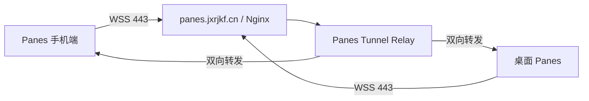
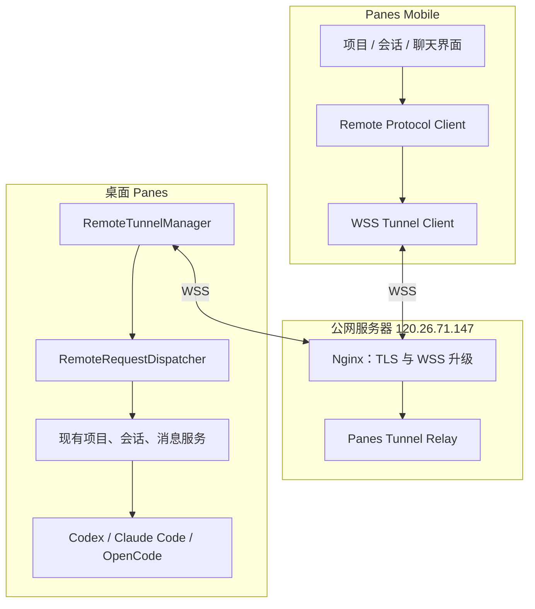

# Panes 手机版设计方案

## 1. 文档信息

- 功能名称：Panes 手机版远程访问
- 方案状态：设计定稿，待实施
- 桌面执行端：Panes
- 手机端：Panes Mobile
- 第一版网络模式：固定公网服务器 + WSS 反向隧道 + 全量中继
- 公网服务器 IP：`120.26.71.147`
- 公网域名：`panes.jxrjkf.cn`
- 公网端口：`443`
- WSS 入口：`wss://panes.jxrjkf.cn/ws/tunnel`
- SSL：复用 `panes.jxrjkf.cn` 现有证书

## 2. 建设目标

Panes 手机版不是桌面界面的等比例缩小版，而是桌面 Panes 的远程聊天控制端。

用户在桌面 Panes 中生成二维码，手机扫码完成连接后，可以在外出状态下：

- 查看当前在线的桌面 Panes。
- 查看桌面 Panes 中的项目。
- 查看项目下面的会话。
- 查看会话历史消息。
- 向指定会话继续发送消息。
- 实时接收智能体的流式输出、执行状态和最终结果。
- 停止当前正在执行的任务。

项目、会话、模型调用和本地文件仍由桌面 Panes 负责。手机端只发送远程指令并展示桌面端返回的数据。

## 3. 已确认的第一版决策

### 3.1 网络决策

第一版只实现一种网络模式：桌面 Panes 和手机端都主动连接固定公网 WSS 入口，由公网服务器完成双向转发。



采用该模式后，两端都只需具备普通的公网访问能力，不需要知道对方的真实 IP。

### 3.2 第一版不包含的网络能力

- 局域网设备发现。
- 局域网直连。
- 公网 IPv4 或 IPv6 直连。
- UPnP、NAT-PMP、PCP 自动端口映射。
- STUN、ICE、UDP 打洞和 NAT 穿透。
- QUIC、WebRTC DataChannel 或 P2P 数据通道。
- TURN 或其他备用中继线路。
- 多个公网中继节点和自动容灾。

即使手机和桌面电脑位于同一局域网，第一版也统一经过公网 WSS 服务器，不设计单独的局域网分支。

### 3.3 业务边界

网络层只负责建立隧道和双向转发。手机与哪台桌面 Panes 关联、采用 Token、账号密码、设备指纹还是其他认证方式，属于业务层。

第一版业务层采用最简单的“一次性二维码配对 Token”完成闭环；协议应保留替换认证方式的能力，但本期不建设完整账号体系。

## 4. 总体架构



### 4.1 手机端职责

- 扫描桌面 Panes 生成的二维码。
- 保存配对结果和远程入口信息。
- 建立并维护 WSS 连接。
- 请求项目、会话和消息数据。
- 发送用户消息和停止指令。
- 展示流式消息、运行状态和错误状态。
- 断线后自动重连并重新获取当前状态。

### 4.2 公网服务器职责

- 在 `443` 端口提供统一 WSS 入口。
- 接收桌面 Panes 主动建立的长连接。
- 接收手机端主动建立的长连接。
- 根据网络级 `tunnel_id` 找到对应的两条连接。
- 将两端的业务数据帧原样双向转发。
- 维护在线状态、心跳时间和连接生命周期。
- 拒绝无效、过期或超出限制的连接和数据帧。

第一版公网服务器不读取项目和会话数据库，不调用 Codex、Claude Code 或 OpenCode，也不长期保存聊天内容。

### 4.3 桌面 Panes 职责

- 在用户开启“手机远程访问”后主动连接公网 WSS 入口。
- 生成并持久化本机的 `tunnel_id` 和设备身份。
- 生成一次性二维码配对信息。
- 接收手机端请求并调用 Panes 现有应用服务。
- 把项目、会话、消息和流式事件返回手机端。
- 在 Panes 退出、远程访问关闭或凭证被撤销时主动断开连接。

桌面端是远程功能的唯一业务执行端。手机端和公网服务器都不得直接读写桌面 Panes 的 SQLite 数据库。

## 5. 公网服务器设计

### 5.1 对外入口

```text
wss://panes.jxrjkf.cn/ws/tunnel
```

- DNS：`panes.jxrjkf.cn` 解析到 `120.26.71.147`。
- 外部端口：`443`。
- TLS：复用现有 SSL 证书。
- 协议：WebSocket Secure。
- 第一版部署：单节点。

### 5.2 Nginx 职责

Nginx 只承担公网入口职责：

- 终止 TLS。
- 完成 WebSocket Upgrade。
- 将 `/ws/tunnel` 转发到本机 Panes Tunnel Relay。
- 设置连接超时、请求大小限制和基础访问日志。
- 日志中不得记录 Token、业务消息正文或完整查询参数。

参考结构如下，内部端口在部署时按服务器实际占用情况确定：

```nginx
location /ws/tunnel {
    proxy_pass http://127.0.0.1:18080;
    proxy_http_version 1.1;
    proxy_set_header Upgrade $http_upgrade;
    proxy_set_header Connection "upgrade";
    proxy_set_header Host $host;
    proxy_read_timeout 3600s;
    proxy_send_timeout 3600s;
    proxy_buffering off;
}
```

### 5.3 Tunnel Relay

Tunnel Relay 是通用的 WSS 反向隧道服务。它只需维护：

```text
tunnel_id -> desktop_connection
tunnel_id -> mobile_connection
```

第一版每个 `tunnel_id` 只允许一个桌面连接和一个活动手机连接。后续如需多手机同时连接，再扩展为手机连接集合。

连接建立后的处理流程：

1. 客户端连接统一 WSS 地址。
2. 客户端发送隧道握手帧，声明 `role`、`tunnel_id`、协议版本和认证信息。
3. Relay 校验握手帧并登记连接。
4. 同一个 `tunnel_id` 的两端都在线后，Relay 开始双向转发。
5. 任意一端断开时，Relay 通知另一端并清理连接映射。
6. 客户端按退避策略重新连接。

Tunnel Relay 在完成握手后不解析业务消息内容，只按连接关系转发 WebSocket 文本帧或二进制帧。

### 5.4 第一版服务端状态

第一版连接关系只保存在内存中：

- 服务重启后连接映射清空。
- 桌面端和手机端自动重新连接。
- 不引入 Redis。
- 不做多节点共享连接。
- 不提供离线消息队列。
- 不保存项目、会话和聊天正文。

## 6. 二维码与首次配对

### 6.1 桌面端入口

建议在 Panes 设置中增加：

`设置 → 手机远程访问`

页面包含：

- 开启或关闭手机远程访问。
- 当前公网服务连接状态。
- 生成或刷新二维码。
- 已绑定手机摘要。
- 撤销已绑定手机。

### 6.2 二维码内容

第一版二维码建议包含：

```json
{
  "version": 1,
  "endpoint": "wss://panes.jxrjkf.cn/ws/tunnel",
  "tunnel_id": "随机 UUID",
  "relay_credential": "Relay 连接凭据",
  "pairing_token": "一次性随机 Token",
  "expires_at": "UTC 时间"
}
```

要求：

- `tunnel_id` 使用不可预测的随机值。
- `pairing_token` 只能使用一次。
- `relay_credential` 只用于 Relay 握手；手机完成业务配对后，业务请求改用桌面签发的正式 `device_credential`。
- 配对 Token 建议在生成后 5 分钟内有效。
- 二维码刷新后，旧的未使用 Token 立即失效。
- Token 不写入 Nginx URL，不进入普通访问日志。
- 手机完成配对后保存正式设备凭证，不继续使用二维码 Token。

### 6.3 配对流程

1. 用户在桌面 Panes 中开启手机远程访问。
2. 桌面 Panes 建立 WSS 连接并显示二维码。
3. 手机扫描二维码并连接同一个 WSS 入口。
4. 手机提交二维码中的配对信息。
5. 桌面 Panes 校验一次性 Token。
6. 桌面 Panes 返回正式连接凭证和设备摘要。
7. 手机保存凭证，二维码 Token 作废。
8. 手机开始请求项目和会话列表。

第一版可直接采用 Token 完成配对。设备指纹、账号密码、统一账户、多因素认证等能力留给后续业务层扩展。

## 7. WSS 隧道协议

### 7.1 隧道握手帧

```json
{
  "version": 1,
  "type": "tunnel.hello",
  "role": "desktop",
  "tunnel_id": "随机 UUID",
  "credential": "连接凭证"
}
```

`role` 第一版支持：

- `desktop`
- `mobile`

握手成功后，Relay 返回：

```json
{
  "version": 1,
  "type": "tunnel.ready",
  "connection_id": "本次连接 ID",
  "peer_online": true
}
```

### 7.2 心跳

第一版采用应用层心跳：

- 每 25 秒发送一次 `tunnel.ping`。
- 收到后立即回复 `tunnel.pong`。
- 连续 75 秒没有收到有效消息或心跳，判定连接失效。
- 连接失效后关闭旧连接并进入自动重连。

### 7.3 重连

重连等待时间建议为：

```text
1 秒 → 2 秒 → 5 秒 → 10 秒 → 30 秒
```

达到 30 秒后保持 30 秒间隔，网络恢复并连接成功后重置退避状态。

桌面端重连成功后重新登记 `tunnel_id`。手机端重连成功后重新请求项目、会话和当前活动会话状态，不依赖服务端补发断线期间的业务消息。

### 7.4 消息限制

- 第一版业务数据使用 JSON 文本帧。
- 单帧最大长度建议限制为 1 MiB。
- 历史消息使用窗口或游标分页，不允许一次返回完整超长会话。
- 第一版不通过隧道传输大文件和附件。
- Relay 必须实现发送队列上限和背压处理，慢客户端不得无限占用内存。

## 8. 手机与桌面业务协议

Tunnel Relay 只转发数据。以下业务协议由手机端和桌面 Panes 处理。

### 8.1 通用消息格式

请求：

```json
{
  "version": 1,
  "kind": "request",
  "id": "请求 UUID",
  "method": "workspace.list",
  "payload": {}
}
```

响应：

```json
{
  "version": 1,
  "kind": "response",
  "id": "原请求 UUID",
  "ok": true,
  "payload": {}
}
```

事件：

```json
{
  "version": 1,
  "kind": "event",
  "event": "stream.updated",
  "payload": {}
}
```

所有请求都必须携带唯一 `id`。对会产生写操作的请求，桌面 Panes 使用该 ID 做短期幂等校验，避免手机断线重试造成重复发送。

### 8.2 第一版方法

| 方法 | 说明 |
| --- | --- |
| `desktop.get_status` | 获取桌面 Panes 在线状态和版本 |
| `workspace.list` | 获取项目列表 |
| `thread.list` | 获取指定项目下的未归档会话 |
| `message.list` | 分页获取指定会话的历史消息 |
| `message.send` | 向指定会话发送用户消息 |
| `turn.stop` | 停止指定会话当前执行 |
| `thread.subscribe` | 订阅指定会话的实时事件 |
| `thread.unsubscribe` | 取消会话实时事件订阅 |

手机界面中的“项目”对应 Panes 的 workspace；如果一个 workspace 包含多个 repo，手机端在项目详情中展示仓库摘要，不把不同 repo 错误地拆成独立 Panes 项目。

### 8.3 第一版事件

| 事件 | 说明 |
| --- | --- |
| `desktop.status_changed` | 桌面在线、离线或版本变化 |
| `thread.updated` | 会话标题、状态或更新时间变化 |
| `stream.updated` | 助手流式文本、推理或工具事件 |
| `turn.finished` | 本轮执行完成 |
| `turn.failed` | 本轮执行失败 |
| `turn.stopped` | 本轮执行已停止 |

桌面 Panes 应把现有线程事件和聊天流事件转换成稳定的远程协议，手机端不得依赖 Codex、Claude Code 或 OpenCode 的原始事件格式。

## 9. 桌面 Panes 集成设计

### 9.1 复用现有数据和执行链

Panes 现有数据模型已经包含 workspace、repo、thread、message、action 和 approval。远程功能应复用现有应用服务，不复制新的项目、会话和消息数据库。

现有 Tauri IPC 和远程请求形成两个实际调用入口时，允许把对应业务逻辑下沉为共享的 Rust 内部方法，由 Tauri command 和 RemoteRequestDispatcher 共同调用。不得为了远程功能复制一套发送消息或获取会话的实现。

### 9.2 建议新增 Rust 模块

```text
src-tauri/src/remote/mod.rs
src-tauri/src/remote/tunnel.rs
src-tauri/src/remote/protocol.rs
src-tauri/src/remote/dispatcher.rs
src-tauri/src/commands/remote.rs
src-tauri/src/db/remote_devices.rs
```

职责建议：

- `tunnel.rs`：WSS 连接、心跳、重连和发送队列。
- `protocol.rs`：版本化的请求、响应和事件 DTO。
- `dispatcher.rs`：将远程方法分派到现有 Panes 应用服务。
- `commands/remote.rs`：远程访问开关、二维码和绑定设备管理 IPC。
- `db/remote_devices.rs`：保存本机 `tunnel_id`、已绑定手机和撤销状态。

### 9.3 建议新增桌面前端模块

```text
src/components/settings/RemoteAccessSettings.tsx
src/stores/remoteAccessStore.ts
```

同时调整：

```text
src/types.ts
src/lib/ipc.ts
src-tauri/src/lib.rs
src-tauri/src/state.rs
src-tauri/src/commands/mod.rs
src-tauri/src/db/mod.rs
src/i18n/resources/en/
src/i18n/resources/pt-BR/
src/i18n/resources/zh-CN/
```

## 10. 手机端设计

### 10.1 技术方案

手机端使用官方命令 `npx degit dcloudio/uni-preset-vue#vite-ts mobile` 创建为 `uni-app + Vue 3 + TypeScript` CLI 工程。入口文件、`manifest.json`、`pages.json` 和页面代码均位于官方脚手架规定的 `mobile/src/` 下。扫码、凭据存储和 WSS 连接分别使用 `uni.scanCode`、uni-app Storage API 和 `uni.connectSocket`，不依赖浏览器专用运行时。

第一阶段同时生成 H5 产物和原生 App 打包资源；Android/iOS 共用业务协议、页面和状态管理。原生 App 资源交给 HBuilderX 完成签名和 APK/AAB/IPA 打包。

### 10.2 页面结构

第一版包含：

1. 扫码配对页。
2. 桌面连接状态页。
3. 项目列表页。
4. 项目会话列表页。
5. 会话聊天页。
6. 连接设置和解除绑定页。

### 10.3 聊天页

聊天页需要支持：

- 用户消息和助手消息。
- Markdown、代码块和基础工具状态展示。
- 历史消息向上分页加载。
- 流式内容增量更新。
- 当前执行状态。
- 消息输入和发送。
- 停止当前执行。
- 网络断开和桌面离线提示。

第一版不要求复刻桌面 Panes 的终端、文件编辑器、Git 面板和所有工具详情。

## 11. 状态和异常处理

### 11.1 桌面离线

- 手机明确显示“桌面 Panes 离线”。
- 项目、会话和消息请求立即失败，不长期等待。
- 第一版禁止离线发送和服务端排队。
- 桌面恢复在线后，手机重新请求当前页面数据。

### 11.2 手机断线

- 手机按退避策略自动重连。
- 未收到明确响应的写请求不得直接生成新的请求 ID 重发。
- 重连后先查询会话当前状态，再决定是否重新提交原请求。

### 11.3 公网服务器重启

- 服务端连接映射丢失属于第一版预期行为。
- 桌面和手机自动重连并重新登记。
- Relay 不负责恢复历史业务数据。

### 11.4 版本不兼容

- 所有隧道帧和业务帧都包含 `version`。
- 桌面端不支持手机版协议版本时返回明确错误。
- 手机端展示“请升级 Panes 桌面端”或“请升级手机版”，不得静默失败。

## 12. 安全设计

第一版至少满足：

- 只允许使用 WSS，不在正式配置中降级为明文 WS。
- TLS 证书域名必须匹配 `panes.jxrjkf.cn`。
- 二维码 Token 一次性、短时有效且不可预测。
- 正式连接凭证支持撤销。
- `tunnel_id` 不作为唯一认证凭证。
- 服务端限制连接数、握手频率、单帧大小和发送队列大小。
- Nginx 和 Relay 日志不记录 Token、消息正文、文件内容和模型输出。
- Relay 不持久化聊天正文。
- 桌面端对所有远程方法实施白名单分派，未知方法直接拒绝。
- 手机端不得通过远程协议调用任意 Tauri command 或任意本机 shell 命令。

第一版 WSS 的 TLS 在 Nginx 终止，因此服务器进程可以接触转发内容。手机与桌面之间的应用层端到端加密作为后续增强，不阻塞第一版网络闭环。

## 13. 第一版功能范围

### 13.1 包含

- 公网 Nginx WSS 入口。
- 单节点 Tunnel Relay。
- 桌面 Panes 主动长连接。
- 手机端主动长连接。
- 二维码一次性 Token 配对。
- 项目列表。
- 会话列表。
- 历史消息分页读取。
- 发送消息。
- 接收流式输出。
- 停止当前执行。
- 在线状态、心跳、断线和重连。
- 解除手机绑定。

### 13.2 不包含

- 局域网直连和局域网自动发现。
- UPnP、NAT-PMP、PCP、STUN、ICE、TURN 和 P2P。
- 离线消息和服务端业务数据持久化。
- 多公网节点、负载均衡和跨节点连接同步。
- 手机端终端、文件编辑、Git 操作和电脑控制。
- 文件与图片附件上传。
- 手机端处理危险命令审批和用户问题问卷。
- 手机系统推送通知。
- 完整账号体系、组织和多租户管理。
- 应用层端到端加密。

## 14. 测试方案

### 14.1 Tunnel Relay 测试

- 桌面和手机使用同一 `tunnel_id` 后可以双向转发。
- 不同 `tunnel_id` 之间的数据不会串线。
- 重复桌面连接按既定规则替换旧连接。
- 非法握手、无效版本和超大数据帧被拒绝。
- 任意一端断开后连接映射能够及时清理。
- 慢客户端不会导致发送队列无限增长。
- Relay 日志不包含 Token 和业务正文。

### 14.2 桌面端测试

- 开启远程访问后建立 WSS 连接。
- 关闭远程访问后立即断开连接。
- 二维码 Token 只能使用一次并按时过期。
- 项目、会话和消息请求复用现有应用服务。
- `message.send` 重试不会重复发送。
- 现有流式事件可以转换为稳定的远程事件。
- 网络恢复后能够自动重连和重新登记。

### 14.3 手机端测试

- 扫码后能够完成配对。
- 能够展示桌面在线和离线状态。
- 能够读取项目、会话和历史消息。
- 能够发送消息并实时展示流式响应。
- 能够停止当前执行。
- 网络切换和短时断网后能够恢复。
- 协议版本不兼容时显示准确提示。

### 14.4 跨网络验收

1. 桌面电脑连接家庭或办公宽带。
2. 手机关闭 Wi-Fi，使用 4G 或 5G 网络。
3. 桌面 Panes 显示已连接 `panes.jxrjkf.cn`。
4. 手机扫码并完成配对。
5. 手机读取项目和会话。
6. 手机向现有会话发送消息。
7. 手机持续接收流式输出直到执行完成。
8. 中断手机网络后恢复，验证自动重连。
9. 重启公网 Tunnel Relay，验证两端自动恢复连接。
10. 关闭桌面 Panes，验证手机及时显示离线且不能离线排队。

桌面 Panes 完成自动化检查后，只使用以下命令生成本地验收程序：

```powershell
pnpm exec tauri build --no-bundle
```

本地验收产物为：

`src-tauri/target/release/Panes.exe`

本地验收阶段不生成 NSIS、MSI、签名安装包或其他发行包。用户完成桌面端和手机端实际测试并明确确认通过后，才能进入推送和正式发布流程；正式多平台打包与发布由 GitHub CI 完成。

## 15. 实施顺序

1. 在公网服务器部署 Nginx WSS 路由和单节点 Tunnel Relay。
2. 使用两个测试客户端完成 WSS 双向转发、心跳和重连验证。
3. 在桌面 Panes 中实现 `RemoteTunnelManager` 和远程访问设置。
4. 定义版本化的手机与桌面业务协议。
5. 复用现有项目、会话、消息和流式事件服务，实现 RemoteRequestDispatcher。
6. 创建 Panes Mobile 工程并完成扫码、项目、会话和聊天页面。
7. 接入一次性 Token、正式凭证和解除绑定。
8. 完成限流、日志脱敏、异常恢复和跨网络测试。
9. 生成 `Panes.exe`，由用户完成桌面端与手机端实际验收。

## 16. 后续演进

第一版稳定后，再根据实际延迟、服务器流量和用户规模评估：

- 同一局域网自动发现和直连。
- 公网 IPv6 直连。
- UPnP、NAT-PMP 和 PCP 端口映射。
- STUN、ICE 和 UDP 打洞。
- QUIC 或 WebRTC DataChannel。
- P2P 优先、中继兜底的多路径选择。
- 多手机同时连接一台桌面 Panes。
- 多公网节点、就近接入和故障迁移。
- 应用层端到端加密。
- 手机系统推送通知。
- 手机端审批、文件、Git、终端和电脑控制能力。

上述能力不得进入第一版网络主链路，避免同时引入寻址、穿透、链路选择和中继容灾复杂度。

## 17. 第一版验收结论条件

满足以下条件，第一版网络与核心业务闭环才算完成：

1. 桌面 Panes 和手机端都只通过 `wss://panes.jxrjkf.cn/ws/tunnel` 建立连接。
2. 手机和桌面不需要知道对方的真实 IP 和局域网地址。
3. 手机能够扫码连接指定桌面 Panes。
4. 手机能够列出桌面 Panes 的项目及项目下的会话。
5. 手机能够读取历史消息并向现有会话发送消息。
6. 手机能够实时看到智能体流式输出和最终状态。
7. 手机能够停止当前执行。
8. 任意一端断线后状态准确，并能在网络恢复后自动重连。
9. 公网服务器不持久化聊天正文，日志不泄露 Token 和业务内容。
10. 第一版没有局域网、UPnP、NAT 穿透或 P2P 隐式分支。

## 18. 已实现工程结构

本方案第一版已经按以下目录落地：

- `relay/`：Tunnel Relay、自动化测试、`Dockerfile`、`docker-compose.yml` 和部署说明。
- `src-tauri/src/remote/`：桌面端 `RemoteTunnelManager`、WSS 重连、业务请求分发、一次性配对和会话快照。
- `src/components/settings/RemoteAccessSettings.tsx`：桌面端远程访问设置、连接状态和二维码管理。
- `mobile/`：独立 uni-app + Vue 3 + TypeScript 手机客户端、H5/App 资源构建配置及打包说明。

公网 Relay 部署仍由用户在服务器上执行。桌面和手机跨 4G/5G 的最终验收必须在 Relay 部署后完成；本地开发阶段已经使用同协议测试夹具完成项目、会话、消息发送、实时快照和停止执行联调。
