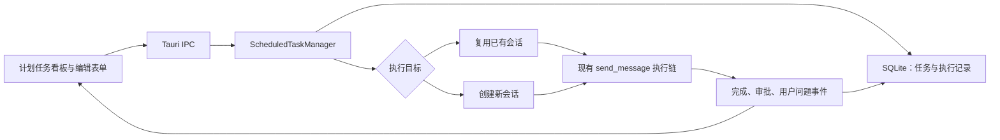

# Panes 计划任务功能模块设计方案

## 1. 文档信息

- 功能名称：Scheduled（计划任务）
- 方案状态：已实现，待本地功能验收
- 第一版运行方式：Rust 后台调度器 + SQLite 持久化 + 托盘常驻
- 第一版不包含：电脑休眠时的系统级唤醒、Panes 完全退出后的系统级唤醒

## 2. 建设目标

在 Panes 左上角全局导航区域增加“Scheduled / 计划任务”入口，为用户提供计划任务的创建、编辑、启用、停用、删除、自动执行和人工确认能力。

计划任务支持：

- 在本机执行，并为将来的多设备执行预留字段和界面结构。
- 在已有会话中执行，或者每次触发时新建会话执行。
- 按间隔、每天或自定义周循环执行。
- 在执行过程中复用 Panes 现有的审批和用户问题处理能力。
- 应用窗口关闭后驻留托盘，继续执行已启用的计划任务。
- 应用重启后恢复任务，不因页面刷新或窗口关闭丢失调度状态。

## 3. 范围边界

### 3.1 第一版包含

- 左上角“计划任务”全局入口。
- “未启用、启用中、需确认”三列看板。
- 计划任务新增、编辑、启用、停用和删除。
- 本机执行设备占位。
- 执行 AGENT 直接复用 Panes 主界面已经加载的 Codex、Claude Code、OpenCode 引擎与模型目录，打开任务表单时不重复探测。
- 按所选 AGENT 联动选择模型和该模型支持的思考级别。
- 已有会话和新建会话两种执行目标。
- 间隔、每天、自定义三种频率。
- Rust/Tokio 后台调度。
- SQLite 任务和执行记录持久化。
- 托盘驻留与主窗口恢复。
- 审批、`request_user_input`、异常中断等需人工处理状态。
- 应用恢复后最多补执行一次错过的任务。

### 3.2 第一版不包含

- 多设备任务同步和远程执行。
- 用户直接输入 Cron 表达式。
- Panes 完全退出后由操作系统启动 Panes 执行任务。
- 电脑处于睡眠或休眠状态时的系统级定时唤醒。
- 计划任务独立的通知策略配置。

计划任务的桌面通知复用 Panes 现有智能体通知设置。Windows Task Scheduler、macOS `launchd`、Linux `systemd timer` 等操作系统级调度作为后续阶段单独设计。

## 4. 用户界面设计

### 4.1 全局入口

在左上角导航区域的“搜索”下方、“智能体”上方增加入口：

`Scheduled / 计划任务`

该入口进入独立的全局页面，不从属于某个项目。中文界面显示“计划任务”，英文界面显示“Scheduled”。

### 4.2 三列看板

页面只显示以下三列：

| 列 | 判定规则 |
| --- | --- |
| 未启用 | 任务已停用，且当前没有待处理的执行 |
| 启用中 | 任务已启用，且当前没有需要用户处理的内容 |
| 需确认 | 执行过程中产生审批、问题询问、目标失效或异常中断，需要用户处理 |

“需确认”的显示优先级最高。即使用户已经停用任务，只要已有执行仍在等待处理，该任务仍显示在“需确认”；处理完成后再根据 `enabled` 状态进入“未启用”或“启用中”。

看板状态不直接保存为一个互斥的任务状态字段，而是根据任务是否启用、最近执行状态和待处理审批动态计算。

### 4.3 任务卡片

任务卡片显示：

- 任务说明第一行，作为卡片标题。
- 执行目标：`项目 / 会话` 或 `项目 / 每次新建会话`。
- 频率摘要。
- 下次执行时间。
- 最近一次执行结果。
- 启用或停用开关。
- 编辑和删除菜单。

第一版不增加独立的“任务标题”字段，避免超出已确认的任务字段范围。

### 4.4 任务表单

任务表单分为“基本信息、执行目标、频率”三个区域。

#### 基本信息

- 任务说明：必填，多行文本；执行时原样作为用户消息发送。
- 执行设备：下拉框；第一版固定为“本机”，保留将来多设备选择结构。
- 执行 AGENT：必选；选项与 Panes 主界面的运行工具选择器使用同一份现有引擎目录，打开或保存任务时不再重复执行健康检查。
- 模型：必选；切换执行 AGENT 后，只显示该 AGENT 当前模型目录中的可用模型。
- 思考级别：所选模型支持思考级别时必选，并且只显示该模型声明支持的值；模型不支持时显示“不支持”并保存为空值。
- 在哪里执行：单选“已存在的会话”或“新建会话”。

#### 执行目标：已有会话

1. 项目必选。
2. 选定项目后开启会话选项。
3. 会话列表只显示该项目下未归档且与所选执行 AGENT 一致的会话。
4. 会话必选。
5. 执行时使用任务中固化的模型和思考级别；执行 AGENT 必须与已有会话的 AGENT 一致。

#### 执行目标：新建会话

1. 项目必选。
2. 隐藏会话选项。
3. 每次计划任务触发时，在指定项目下新建一个会话。
4. 会话标题由任务说明第一行和计划执行时间生成。
5. 保存任务时固化用户选择的执行 AGENT、模型和思考级别，并保留当前新建会话的服务等级和执行权限配置，避免全局默认配置变化导致任务行为漂移。

#### 频率

| 类型 | 可配置项 |
| --- | --- |
| 间隔 | 每隔 N 分钟、小时或天 |
| 每天 | 每天在指定时间执行 |
| 自定义 | 每 N 周、选择一个或多个星期、指定执行时间 |

第一版的“自定义”严格按周循环实现，不开放 Cron 表达式。

所有任务均按创建时的本机时区执行。数据库同时保存时区标识和 UTC 格式的 `next_run_at`，用于处理应用重启、系统时区和夏令时变化。

## 5. 总体架构



### 5.1 前端职责

- 展示三列看板。
- 维护任务表单交互和校验。
- 根据项目筛选可选会话。
- 调用 Tauri IPC 完成任务的增删改查和启停。
- 监听计划任务更新事件，实时刷新任务状态。
- 从“需确认”卡片跳转到对应项目和会话。

前端不使用 `setInterval`、`setTimeout` 或 Web Worker 承担实际调度，避免页面卸载、窗口关闭和 WebView 挂起导致任务丢失。

### 5.2 Rust 后台组件

新增 `ScheduledTaskManager`，作为 Tauri 托管状态的一部分，负责：

- 启动时加载已启用任务。
- 查询最近一个 `next_run_at`。
- 使用 Tokio `sleep_until` 等待下一次执行。
- 使用 `Notify` 在新增、编辑、启停或删除任务后立即重新计算等待时间。
- 原子抢占到期任务，防止重复执行。
- 计算并保存下一次执行时间。
- 调用已有会话或新建会话执行链。
- 跟踪执行完成、审批、用户问题和异常状态。
- 向前端发送任务状态更新事件。

第一版不直接依赖 `tokio-cron-scheduler`。当前频率模型只有间隔、每天和周循环，使用类型化的频率模型和 `chrono-tz` 计算更容易校验，也更便于持久化和测试。第三方调度库本身不能解决应用退出、电脑休眠、会话关联和审批状态问题。

### 5.3 会话执行桥接

现有 `send_message` 是 Tauri command。实现时将其核心逻辑抽取为可在 Rust 内部复用的 `send_message_inner`，Tauri command 和计划任务调度器共同调用该方法，避免复制一套消息执行逻辑。

现有新建会话逻辑已经包含内部方法，调整可见范围后由计划任务调度器复用。

计划任务执行后保存返回的 `assistant_message_id`，用于把执行记录与审批、用户问题、执行完成事件关联起来。

## 6. 数据模型

### 6.1 `scheduled_tasks`

| 字段 | 说明 |
| --- | --- |
| `id` | 任务 ID |
| `description` | 任务说明 |
| `enabled` | 是否启用 |
| `execution_device_id` | 执行设备；第一版固定为 `local` |
| `target_type` | `existing_thread` 或 `new_thread` |
| `workspace_id` | 所属项目 ID |
| `thread_id` | 已有会话模式下必填 |
| `runtime_config_json` | 两种执行目标共用的运行配置快照，包含执行 AGENT、模型、思考级别及兼容的会话运行参数 |
| `schedule_type` | `interval`、`daily` 或 `weekly` |
| `schedule_json` | 不同频率的具体配置 |
| `timezone` | 创建任务时的本机时区 |
| `next_run_at` | 下次执行时间，UTC |
| `last_run_at` | 最近一次实际启动时间，UTC |
| `created_at` | 创建时间 |
| `updated_at` | 更新时间 |

建议索引：

- `enabled, next_run_at`
- `workspace_id`
- `thread_id`

### 6.2 `scheduled_task_runs`

| 字段 | 说明 |
| --- | --- |
| `id` | 执行记录 ID |
| `task_id` | 计划任务 ID |
| `scheduled_for` | 本次原计划执行时间 |
| `started_at` | 实际开始时间 |
| `finished_at` | 完成时间 |
| `thread_id` | 本次实际使用的会话 ID |
| `assistant_message_id` | 对应的助手消息 ID |
| `status` | 本次执行状态 |
| `error_message` | 异常信息 |
| `result_preview` | 执行结果摘要 |

执行状态建议包括：

- `queued`
- `running`
- `needs_confirmation`
- `completed`
- `error`
- `interrupted`
- `skipped`

通过 `task_id + scheduled_for` 唯一约束保证同一个计划时间只产生一条执行记录，防止应用重启、调度器重复唤醒或并发查询造成重复执行。

## 7. 调度计算规则

### 7.1 间隔

- 从上一次计划时间计算下一次时间，不从实际完成时间计算，避免长任务造成调度漂移。
- 应用长时间未运行时，不逐条补齐所有遗漏周期。

### 7.2 每天

- 按任务保存的时区和指定本地时间计算。
- 启动时计算第一个大于当前时间的执行点。

### 7.3 自定义周循环

- 保存周间隔、星期集合和本地执行时间。
- 星期集合至少选择一个值。
- 按任务创建时间确定周循环锚点。

### 7.4 错过任务

- 窗口关闭到托盘时，调度器仍正常执行，不属于错过任务。
- Panes 完全退出或电脑休眠期间产生的多个过期执行点，恢复后最多补执行一次。
- 补执行完成后直接计算下一个未来执行时间，不追补历史上的每一个周期。

## 8. 执行和并发规则

- 同一个计划任务不允许同时存在两个运行中的执行。
- 同一个已有会话不允许并发发送两条消息。
- 目标会话忙碌时先短时间延后；超过等待上限后，将本次执行标记为 `skipped`，不强行并发执行。
- 计划任务进入审批或 `request_user_input` 后，本次执行标记为 `needs_confirmation`。
- 存在 `needs_confirmation` 执行时，不继续堆积该任务的后续执行。
- 用户完成审批或回答问题后，本次执行继续运行；最终完成后，任务根据 `enabled` 状态回到“启用中”或“未启用”。
- 目标会话被归档、删除或所属项目失效时，任务进入“需确认”。
- 应用异常退出后，启动恢复逻辑将遗留的 `running` 执行标记为 `interrupted`，不自动重放，避免重复修改文件、重复提交或重复调用外部系统。

## 9. 托盘常驻与应用生命周期

第一版采用关闭到托盘方式保证 Rust 调度器持续运行：

- 关闭主窗口：隐藏窗口，不结束 Panes 进程。
- 点击托盘图标：显示并聚焦主窗口。
- 托盘菜单“打开 Panes”：显示主窗口。
- 托盘菜单“退出 Panes”：释放终端、保持唤醒组件和调度器资源，然后真正退出进程。

运行边界如下：

| 场景 | 第一版结果 |
| --- | --- |
| 窗口打开 | 按时执行 |
| 窗口最小化 | 按时执行 |
| 窗口关闭并驻留托盘 | 按时执行 |
| 用户从托盘退出 Panes | 无法按时执行；重新启动后最多补执行一次 |
| 电脑睡眠或休眠 | 休眠期间不能执行；唤醒后最多补执行一次 |

如果后续要求 Panes 完全退出或电脑休眠时仍能准时执行，则需要按操作系统分别实现任务注册和唤醒能力，不能依靠应用进程内的 Tokio 调度器完成。

## 10. 前端模块建议

建议新增：

- `src/components/scheduled/ScheduledTasksPage.tsx`
- `src/components/scheduled/ScheduledTaskBoard.tsx`
- `src/components/scheduled/ScheduledTaskCard.tsx`
- `src/components/scheduled/ScheduledTaskModal.tsx`
- `src/components/scheduled/ScheduleEditor.tsx`
- `src/stores/scheduledTaskStore.ts`
- `src/lib/scheduleFormatters.ts`

同时调整：

- `src/components/sidebar/Sidebar.tsx`
- `src/components/layout/ThreeColumnLayout.tsx`
- `src/stores/uiStore.ts`
- `src/types.ts`
- `src/lib/ipc.ts`
- 中文、英文和葡萄牙语 i18n 资源
- `src/globals.css`

## 11. Rust 模块建议

建议新增：

- `src-tauri/src/scheduled_tasks/mod.rs`
- `src-tauri/src/scheduled_tasks/manager.rs`
- `src-tauri/src/scheduled_tasks/schedule.rs`
- `src-tauri/src/db/scheduled_tasks.rs`
- `src-tauri/src/commands/scheduled_tasks.rs`
- `src-tauri/src/db/migrations/003_scheduled_tasks.sql`

同时调整：

- `src-tauri/src/state.rs`：注册 `ScheduledTaskManager`。
- `src-tauri/src/lib.rs`：启动调度器、注册 IPC、增加托盘和关闭事件处理。
- `src-tauri/src/models.rs`：增加任务和执行记录 DTO。
- `src-tauri/src/commands/chat.rs`：抽取内部发送方法并回写任务执行状态。
- `src-tauri/src/commands/threads.rs`：开放内部新建会话方法供调度器调用。
- `src-tauri/src/db/mod.rs`：加载新迁移和数据库模块。

## 12. 事件设计

建议新增前端事件：

- `scheduled-task-updated`
- `scheduled-task-deleted`
- `scheduled-task-run-updated`

已有聊天事件继续负责普通会话 UI。计划任务执行链通过 `assistant_message_id` 找到对应执行记录，并在以下节点回写：

- 消息开始执行。
- 请求审批。
- 请求用户输入。
- 用户完成审批或输入。
- 消息执行完成。
- 消息执行出错或中断。

## 13. 测试方案

### 13.1 Rust 单元测试

- 间隔任务下一次执行时间计算。
- 每天任务跨天计算。
- 周循环、跨周和多星期计算。
- 时区和夏令时边界。
- 错过多个周期时只补执行一次。
- 任务原子抢占和唯一约束。
- 同一任务和同一会话并发保护。
- 重启后遗留运行记录恢复。
- 已有会话、新建会话和失效目标校验。

### 13.2 前端单元测试

- 三列状态映射和“需确认”优先级。
- 执行方式切换后的字段显隐。
- 项目与会话级联选择。
- 不同频率的字段校验和序列化。
- 任务卡片摘要和下次执行时间显示。
- “需确认”卡片跳转到对应会话。

### 13.3 本地功能验收

1. 创建一分钟间隔任务，验证已有会话执行。
2. 创建每天任务，验证指定时间执行。
3. 创建自定义周循环任务，验证星期和时间计算。
4. 创建“新建会话”任务，验证每次生成新会话。
5. 触发审批和 `request_user_input`，验证任务进入“需确认”。
6. 完成确认，验证任务回到“启用中”。
7. 关闭主窗口，验证托盘驻留和任务继续执行。
8. 退出并重新启动 Panes，验证任务恢复且不重复执行。
9. 归档或删除目标会话，验证任务进入“需确认”。

完成自动化检查后，仅使用以下命令生成本地验收程序：

```powershell
pnpm exec tauri build --no-bundle
```

验收产物为：

`src-tauri/target/release/Panes.exe`

本地实际功能测试通过并明确确认后，才进入后续提交和推送流程。

## 14. 实施顺序

1. 增加数据库表、类型化频率模型和时间计算测试。
2. 实现 `ScheduledTaskManager`、任务唤醒、原子抢占和启动恢复。
3. 抽取并复用现有新建会话和发送消息逻辑。
4. 接入审批、用户问题、完成、错误和中断状态。
5. 实现托盘和关闭到托盘。
6. 实现三列看板和任务编辑表单。
7. 补齐 i18n、前后端单元测试和集成测试。
8. 执行自动化检查并生成 `Panes.exe`，交由用户本地验收。

## 15. 参考资料

- [Tauri 2 System Tray 官方文档](https://v2.tauri.app/learn/system-tray/)
- [tokio-cron-scheduler 文档](https://docs.rs/tokio-cron-scheduler/latest/tokio_cron_scheduler/)
- [Microsoft TaskSettings.WakeToRun 官方说明](https://learn.microsoft.com/en-us/windows/win32/taskschd/tasksettings-waketorun)
